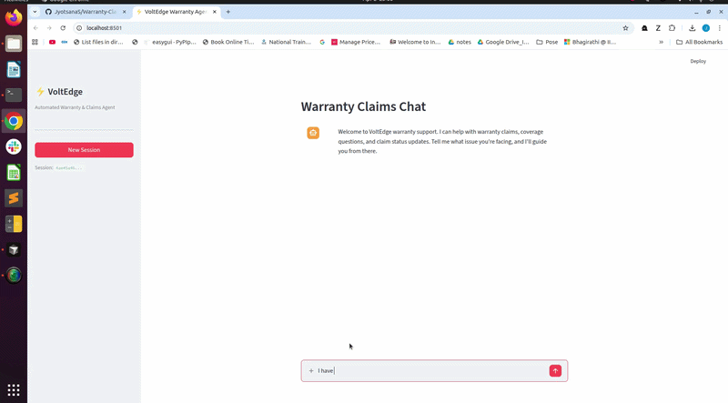
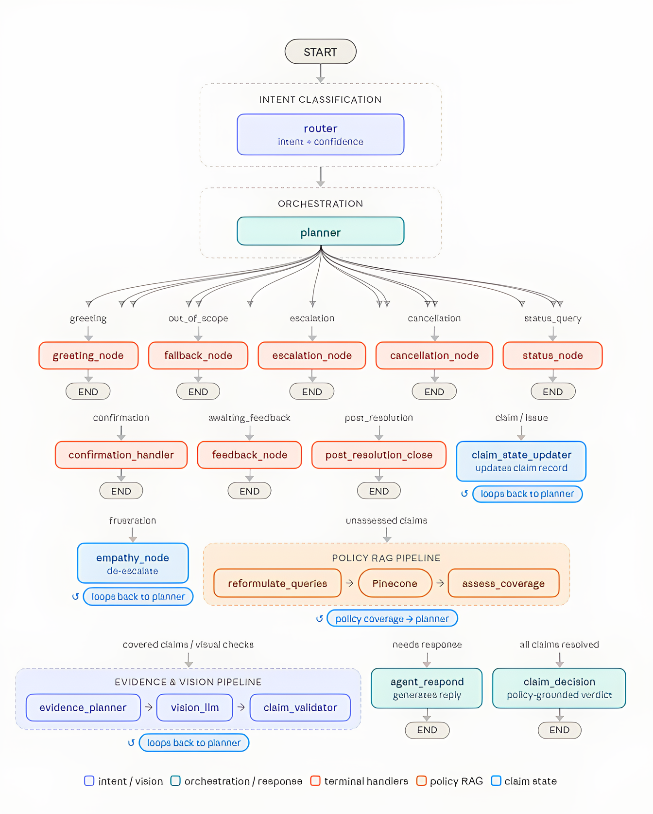

# VoltEdge Warranty & Claims Agent

Multimodal warranty-support prototype built for the ChargePoint take-home exercise. The system combines:

- a FastAPI backend for session management and streaming agent responses
- a Streamlit frontend for chat, image upload, and claim-status display
- a LangGraph-based agent for conversation state and orchestration
- Pinecone-backed retrieval for policy grounding
- vision analysis for uploaded damage evidence

## Demo



Example run artifacts and saved traces are available under [`results/`](results/).

## System Overview

This system is built as a planner-reasoning based agent for warranty and claims handling, not as a single free-form chatbot.
Each user turn enters through FastAPI, which manages the session, stores any uploaded image, and streams agent events back to the client.
Inside the agent runtime, an LLM router first classifies what the user is trying to do, such as reporting a claim, asking for status, or escalating.
A central planner then decides what the agent should do next based on both the current intent and the full session state.
That planner can trigger structured claim-state extraction, policy retrieval, policy reasoning, evidence planning, vision analysis, and final decision generation.
The retrieval path grounds policy reasoning in the warranty corpus, while the vision path validates uploaded evidence before a claim is approved.
Guardrails run alongside the workflow to catch prompt injection, ungrounded policy reasoning, and unusable images before they corrupt the claim flow.
The result is a stateful, observable claim workflow where routing, reasoning, validation, and final user communication are treated as separate responsibilities.

## High-Level Design



## Key Documents

- [`docs/ARCHITECTURE.md`](docs/ARCHITECTURE.md): production architecture, scaling considerations, and guardrail design
- [`docs/EVALS.md`](docs/EVALS.md): evaluation strategy, implemented benchmarks, and production monitoring plan
- [`docs/MODELLING-DECISIONS.md`](docs/MODELLING-DECISIONS.md): schema design and modelling tradeoffs
- [`docs/AI_USAGE.md`](docs/AI_USAGE.md): how AI tools were used during development
- [`docs/REQUIREMENTS.md`](docs/REQUIREMENTS.md): original exercise brief and scope

## Functional Prototype

The agent helps a user:

- describe a charger or hardware issue in natural language
- retrieve relevant warranty policy context
- upload supporting images
- receive a policy-grounded claim outcome such as `approved`, `rejected`, or `pending`

The implementation includes:

- a FastAPI backend for session lifecycle, image upload, and SSE streaming
- a Streamlit frontend for chat, image submission, and claim result display
- a stateful LangGraph agent with router, planner, retrieval, vision, and decision nodes
- RAG-backed policy grounding against the warranty corpus
- structured visual validation before final claim approval
- runtime guardrails for prompt injection, policy hallucination, and image quality

## Quickstart

Prerequisites:

- Python 3.12
- `uv`
- Docker and Docker Compose for containerized setup
- API credentials for the providers you intend to use

Create your local env file from [`env.example`](env.example):

```bash
cp env.example .env
```

At minimum, configure:

- `GROQ_API_KEY`
- `PINECONE_API_KEY`
- `PINECONE_INDEX_NAME`
- `PINECONE_NAMESPACE`

Install dependencies:

```bash
uv sync
```

Index the sample policy into Pinecone before running the app:

```bash
uv run python rag/indexer.py
```

If you need to rebuild the namespace from scratch, run:

```bash
uv run python rag/indexer.py --force
```

Run the backend:

```bash
uv run uvicorn app.main:app --reload --host 0.0.0.0 --port 8000
```

Run the frontend in a second terminal:

```bash
uv run streamlit run ui/app.py --server.address 0.0.0.0 --server.port 8501
```

Open:

- frontend: `http://localhost:8501`
- backend health: `http://localhost:8000/health`

For a one-command containerized setup:

```bash
docker compose up --build
```

The frontend is configured to call the backend service inside Compose using `BACKEND_URL=http://backend:8000`. Session artifacts are written under `RESULTS_DIR`, which defaults to `./results`.

## Example Workflow

1. The user opens a session and describes a hardware issue, optionally uploading an image.
2. The router classifies the turn intent, and the planner decides the next workflow step from full session state.
3. The agent updates structured claim state and retrieves the relevant warranty policy sections when policy grounding is needed.
4. If visual evidence is required, the agent plans the visual checks, runs multimodal image analysis, and validates the result.
5. The agent returns a policy-grounded claim outcome such as `approved`, `rejected`, or `pending`, and persists the trace and session artifacts for review.

## Testing and Evaluation

Run the full test suite:

```bash
uv run pytest -q
```

Run only non-integration tests:

```bash
uv run pytest -q -m "not integration"
```

Notes:

- most tests are unit tests
- integration tests are marked with `@pytest.mark.integration`
- Pinecone-backed integration tests require a valid `.env`

Implemented evals are documented in [`docs/EVALS.md`](docs/EVALS.md). Current coverage includes end-to-end answer correctness, turn efficiency, vision correctness, and RAG context recall and precision, along with guardrail and component-level test coverage.
Sample traces and session artifacts used for inspection and eval development are available under [`results/`](results/).

## API Summary

Main endpoints:

- `POST /api/v1/sessions`
- `POST /api/v1/sessions/{session_id}/messages`
- `GET /health`

Agent responses are streamed over SSE from the message endpoint.

## Key Design Choices

- Router and planner are separate by design: the router answers what the user wants, while the planner decides what the agent should do next from the full session state.
- Claim validation is deterministic after vision and policy reasoning so that final verdict transitions are explicit and auditable.
- Guardrails are applied during execution, not only offline, to block prompt injection, catch ungrounded policy reasoning, and reject unusable images before they affect a claim decision.
- Tracing is built into the runtime through OpenInference-style instrumentation so claims can be inspected turn by turn and later replayed for evaluation.

## Known Limitations

- Active session state is process-local and in-memory, so the current implementation is a prototype rather than a horizontally scaled deployment.
- Session artifacts and uploaded images are stored on the local filesystem under `RESULTS_DIR`, not in shared durable object storage.
- The system depends on external model and retrieval providers, so local runs require valid credentials and can still inherit provider latency or availability issues.
- The eval framework is implemented but still incomplete; additional coverage is still needed for intent accuracy, planning accuracy, coverage reasoning quality, and broader conversation quality.

## Repo Structure

- [`app/`](app/) FastAPI app and API routes
- [`ui/`](ui/) Streamlit frontend
- [`agent/`](agent/) LangGraph agent, nodes, prompts, guardrails
- [`rag/`](rag/) retrieval and indexing logic
- [`storage/`](storage/) local persistence for session artifacts and images
- [`data/`](data/) sample policy and scenarios
- [`tests/`](tests/) unit and integration tests
- [`docs/`](docs/) architecture, eval, modelling, AI usage, and requirements documents
