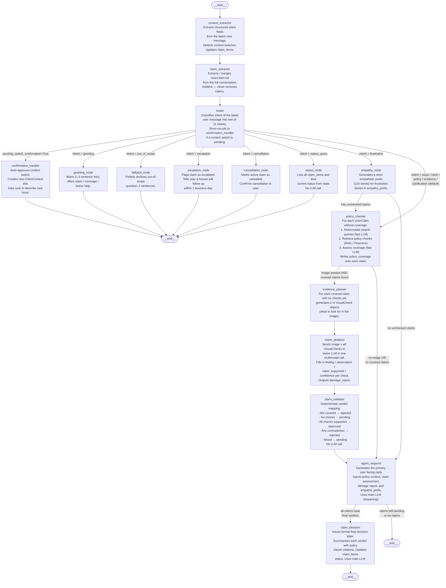

# Agent Logic — VoltEdge LangGraph Graph

Source: `agent/graph.py` and `agent/nodes/`

---

## Graph Topology



---

## Nodes Reference

| Node | File | LLM | Role |
|------|------|-----|------|
| `context_extractor` | `agent/nodes/context_extractor.py` | `fast_llm` | Extract structured fields (component, dates, has_image, etc.) from latest message; detect context switches |
| `claim_extractor` | `agent/nodes/claim_extractor.py` | `fast_llm` | Extract / merge `UserClaim` list from full conversation history |
| `router` | `agent/nodes/router.py` | `fast_llm` | Classify intent → one of 11 intents; short-circuit on pending switch |
| `confirmation_handler` | `agent/nodes/simple_nodes.py` | none | Auto-approve context switch, create new claim slot |
| `greeting_node` | `agent/nodes/simple_nodes.py` | `main_llm` | Respond to greeting |
| `fallback_node` | `agent/nodes/simple_nodes.py` | `main_llm` | Decline out-of-scope message |
| `escalation_node` | `agent/nodes/simple_nodes.py` | none | Mark claim escalated, notify user |
| `cancellation_node` | `agent/nodes/simple_nodes.py` | none | Mark claim cancelled, notify user |
| `status_node` | `agent/nodes/simple_nodes.py` | none | Read claim_items from state and display statuses |
| `empathy_node` | `agent/nodes/empathy.py` | `main_llm` | Generate ≤20-word empathy prefix; stored in `empathy_prefix` |
| `policy_checker` | `agent/nodes/policy_checker.py` | `fast_llm` × 2 + RAG | Query reformulation → vector retrieval → coverage assessment per claim |
| `evidence_planner` | `agent/nodes/evidence_planner.py` | `fast_llm` | Generate 2–4 `VisualCheck` objects per covered claim |
| `vision_analysis` | `agent/nodes/vision_analysis.py` | `vision_llm` | Single multimodal call: image + all checks → findings per check + damage_report |
| `claim_validator` | `agent/nodes/claim_validator.py` | none | Deterministic verdict from check results (approved / rejected / pending) |
| `agent_respond` | `agent/nodes/agent_respond.py` | `main_llm` | Compose user-facing reply with all context |
| `claim_decision` | `agent/nodes/claim_decision.py` | `main_llm` | Final formal decision letter with policy citations |

---

## Conditional Edge Logic

### `router` → next node
```python
if state.pending_switch_confirmation:
    → confirmation_handler
else:
    intent map:
        greeting       → greeting_node
        out_of_scope   → fallback_node
        escalation     → escalation_node
        cancellation   → cancellation_node
        status_query   → status_node
        frustration    → empathy_node
        * (default)    → policy_checker   # issue / claim / policy / evidence / clarification
```

### `empathy_node` → next node
```python
has_pending = any claim with policy_coverage is None
→ policy_checker   if has_pending
→ agent_respond    otherwise
```

### `policy_checker` → next node
```python
has_image = bool(state.image_local_path)
policy_valid = claims that are covered AND have visual_checks planned

→ evidence_planner   if has_image AND (policy_valid OR any claim has visual_checks)
→ agent_respond      otherwise
```

### `agent_respond` → next node
```python
all_resolved = all claims have verdict in {approved, rejected, escalated}

→ claim_decision   if all_resolved AND user_claims non-empty
→ END              otherwise
```

---

## State (`models/state.py` — `AgentState`)

| Key | Type | Description |
|-----|------|-------------|
| `session_id` | `str` | Session UUID |
| `trace_id` | `str` | Request trace ID |
| `turn_count` | `int` | Conversation turn counter |
| `messages` | `list[dict]` (append-only) | Full conversation history `{role, content}` |
| `empathy_prefix` | `str` | Short empathy sentence prepended to next response |
| `image_local_path` | `str \| None` | Path to uploaded image for this turn |
| `policy_context` | `list[str]` | Retrieved policy text chunks |
| `policy_clauses` | `list[str]` | Deduplicated clause references (e.g. `§2`, `§3.1`) |
| `damage_report` | `dict` | Vision output: quality, confidence, purchase date, serial |
| `claim_items` | `list[dict]` | `ClaimContext` per open issue (structured fields) |
| `active_claim_index` | `int` | Index into `claim_items` for the current focus |
| `user_claims` | `list[dict]` | `UserClaim` per extracted assertion (component + verdict) |
| `intent` | `str` | Classified intent from router |
| `router_confidence` | `float` | Router classification confidence |
| `context_switch_detected` | `bool` | New unrelated issue detected in this turn |
| `pending_switch_confirmation` | `bool` | Waiting to confirm context switch before proceeding |
| `token_count` | `int` | Running token budget tracker |

---

## Happy-Path Flows

### Flow 1 — No image, claim covered
```
START → context_extractor → claim_extractor → router (issue)
     → policy_checker [RAG: covered, no image]
     → agent_respond [verdict still pending]
     → END
```

### Flow 2 — Image submitted, claim covered, all checks pass
```
START → context_extractor → claim_extractor → router (issue/evidence)
     → policy_checker [RAG: covered, image present]
     → evidence_planner [generates VisualChecks]
     → vision_analysis  [fills findings]
     → claim_validator  [verdict: approved]
     → agent_respond
     → claim_decision   [formal letter]
     → END
```

### Flow 3 — Frustrated user, then submits image
```
START → context_extractor → claim_extractor → router (frustration)
     → empathy_node [has pending claims]
     → policy_checker → evidence_planner → vision_analysis
     → claim_validator → agent_respond → claim_decision → END
```

### Flow 4 — Greeting / out-of-scope / escalation
```
START → context_extractor → claim_extractor → router (greeting | out_of_scope | escalation)
     → {greeting_node | fallback_node | escalation_node}
     → END
```

### Flow 5 — Context switch mid-session
```
START → context_extractor [context_switch_detected=True, pending_switch_confirmation=True]
     → claim_extractor → router [pending_switch_confirmation bypasses LLM]
     → confirmation_handler [creates new ClaimContext slot]
     → END
```
